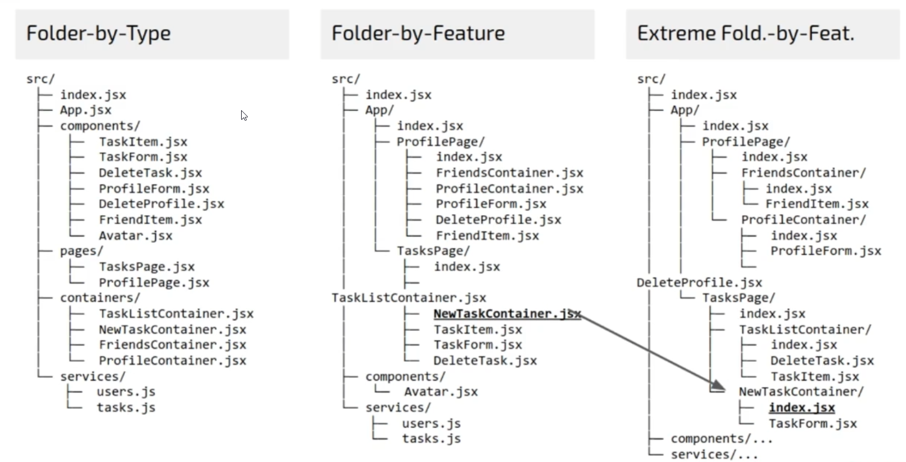

# Primera aplicación de React
Repositorio de ayuda: [Project](https://github.com/AlvYuste/react-course-wishlist)

## Setup
1. Instalamos nvm (node version manager) desde su [repositorio oficial](https://github.com/nvm-sh/nvm). En mi caso usaré la [version de windows](https://github.com/coreybutler/nvm-windows)
2. Instalamos [NodeJS](https://nodejs.org/en/download). Deberá incluir npm.
   > Revisamos las instalaciones necesarias con:
   > * nvm -v
   > * node -v
   > * npm -v

   > *Es una opción trabajar con Yarn que es un extensor de npm*
3. Navegamos hasta la carpeta donde desarrollaremos el proyecto y lanzamos *npm init*
4. La consola nos irá preguntando una serie de cosas. Si las dejamos vacías admitimos o sus valores por defecto o vacío. En mi caso solo complete el repositorio de github. Se genera un archivo *package.json* con las configuraciones. Esto será necesario para controlar todas las dependencias.
5. Instalamos la dependencia de React: **npm install --save react**
6. Instalamos el empaquetador Parcel: **npm install --save-dev parcel-bundler**
7. Instalamos la dependencia de React-DOM: **npm install --save react-dom**
8. En este momento decidimos implementar **Yarn** en el proyecto:
   1. npm install -g yarn
   2. yarn add --dev parcel-bundler
9. Añadimos el script **"start": "parcel index.html"** al archivo package.json y ya tendríamos disponible el comando *yarn start* que ejecutaría el archivo index.html. Recordar estar en la ruta del index.html
10. Generamos un fichero **index.jsx** e importamos React y React-DOM. Renderizamos un simple div de ejemplo.
11. Tendremos en cuenta el Code style
    1.  Estructura de carpetas
        * project-folder/
            * src/
            * dist/
        *  package.json (raiz o punto de entrada)
        *  all-config-files
    2.  Linting
    3.  Format

## Carpeta src/
Será la que contenga los archivos de código. Hay varias estrategias posibles:



No hay una solución buena o mala. Dependerá de para que necesitemos esa estructura. La más simple es la izquierda y la más compleja la derecha.

## ESLint
1. Instalar: **npm install -g eslint**
2. Inicializa ESLint en el proyecto: **eslint --init** (También podemos usar **npm init @eslint/config**). Lo habitual es elegir las siguientes configuraciones:
   * To check syntax and find problems
   * JavaScript modules (import/export)
   * React
   * Browser
   * Config file: JSON
   * TypeScript de momento no
   * Local ESLint (eslint-plugin-react@latest eslint@latest) no instalarlo porque colisionaría con ciertas configuraciones de Yarn.

   Tras todo esto se genera un fichero .eslintrc.json con las configuraciones.

   Dentro de ese JSON existe un objeto que tiene la propiedad rules donde generalmente incluiremos detalles.

   Generalmente se añade en extends "airbnb" que es un referente nuevo para limpieza de código. En rules se agrega "linebreak-style": "off"

   El ESLint por defecto genera este documento JSON
   ```json
   {
    "env": {
        "browser": true,
        "es2021": true
    },
    "extends": [
        "eslint:recommended",
        "plugin:react/recommended"
    ],
    "parserOptions": {
        "ecmaVersion": "latest",
        "sourceType": "module"
    },
    "plugins": [
        "react"
    ],
    "rules": {
    }
   }
   ```

    Nosotros trabajaremos en principio con esta configuración

    ```json
    {
        "extends": "airbnb",
        "env": {
            "browser": true
        },
        "rules": {
            "linebreak-style":"off"
        }
    }
    ```

Necesitaremos instalar en nuestro Yarn la dependencia de desarrollo del eslint de airbnb. <br> **yarn add --dev eslint-config-airbnb** <br> **yarn add --dev eslint-plugin-jsx-a11y**<br> **yarn add --dev eslint-plugin-react**<br> **yarn add --dev eslint-plugin-import**

Todas estas dependencias se cargan el el fichero package.json

3. Añadir un script de lint en el package-json: **"lint": "eslint --fix src/**/*.{js, jsx}"**
   
    npm install --dev lint-staged husky

    Configurar el pre-comit hook en el package.json

    ```json
        {
            "husky": {
                "hooks": {
                    "pre-commit":"lint-staged"
                }
            },
            "lint-staged": {
                "src/**/*.{js, jsx}": ["npm run lint"]
            }
        }
    ```

## Formato
* Prettier
* EditorConfig

Instalamos los plugins en nuestro proyecto y lo añadimos al package.json

npm install --dev prettier
```json
    {
        ...
        "script": {
            ...
            "format": "prettier --write \"*.{js, jsx, json, css}\""
        },
        "prettier": {
            "trailingComma": "all",
            "singleQuote: true
        }
    }
```

Dentro de la configuración de husky agregar este json

```json
    {
        "lint-staged": {
            "src/**/*.{js, jsx}": [
                "npm run lint"
            ],
            "src/**/*.{js, jsx, json, css, scss}": [
                "prettier --write",
                "git add"
            ]
        }
    }
```

Desde el VSCode podemos usar la extension editorConfig. Instalamos la dependencia y agregamos el fichero *.editorconfig*

## DEBUG - Chrome
* [React Developer Tools](https://chrome.google.com/webstore/detail/react-developer-tools/fmkadmapgofadopljbjfkapdkoienihi)
